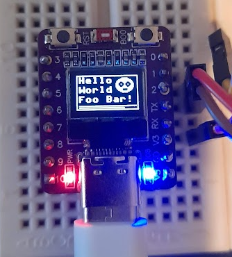

# ESP32-C3-OLED
A small working MicroPython driver for the **ESP32-C3-OLED**.

I picked it up here: https://www.aliexpress.com/item/1005007342383107.html

# Specifications

The framebuffer is a 1-bit framebuffer, with dimensions ```128 x 64``` pixels.
The ```ssd1306``` driver is a subclass of the framebuf module.

This implementation automatically offsets the framebuffer by 28 pixels in the x direction and 24 pixels in the y direction.

# Dependencies
Minimum dependencies. Only needs the framebuffer class from the firmware.

# Firmware

Tested with the ```ESP32_GENERIC_C3-20241129-v1.24.1.bin``` firmware.

# Usage

Ensure the **esp32_c3_oled.py** driver is in the same directory as **main.py** on your ESP32-C3-OLED board.

Upload both the **main.py** and **esp32_c3_oled.py** files to the board.
See the ```main.py``` for example code.

No fonts are supported, and you can only draw 3 rows of text at a time.

# Development Environment
Developed in VSCode with the Raspberry Pi Pico Project extension.


Have fun :)



